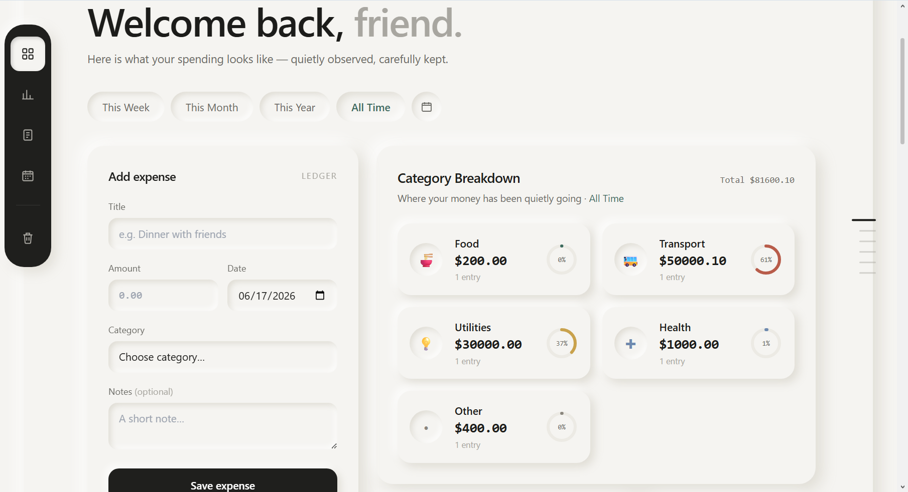

# ExpenseLog — Personal Expense Tracking Service

  

<h3 align="center">
A clean, responsive personal finance dashboard to track, analyze, and manage daily expenses.
</h3>

---

## ✨ Overview

ExpenseLog is a single-page personal expense tracking application designed to help users record, organize, and understand their spending habits through an intuitive dashboard.

The application allows users to add, edit, delete, search, filter, visualize, and export expenses while keeping data stored locally in the browser.

Built with a focus on:
- Simple user experience
- Clean visual hierarchy
- Responsive design
- Data visualization
- Practical finance management

---

# 🚀 Features

## 1. Expense Management

Users can easily manage their expenses with:

✅ Add new expenses

Each expense contains:
- Title
- Amount
- Category
- Date
- Optional notes

✅ Edit existing expenses

Users can update any saved expense entry.

✅ Delete expenses

Remove unwanted records with confirmation.

---

# 📊 Dashboard & Analytics

## Spending Summary

The dashboard provides quick insights including:

- Total spending
- Number of expense entries
- Monthly spending overview
- Category-wise breakdown

---

## 🥧 Category Spending Visualization

A dynamic donut chart shows how money is distributed across categories.

Users can quickly understand spending patterns across:

- Food
- Transport
- Utilities
- Health
- Entertainment
- Shopping
- Education
- Other

---

# 📋 Expense Details Section

The expense list provides a complete overview of transactions.

Features:

- Sorted by latest date
- Responsive table/card layout
- Category indicators
- Search functionality
- Category filtering
- Edit and delete actions

---

# 📈 Monthly & Yearly Insights

The application includes:

- Current month spending summary
- Monthly comparison
- Spending trend visualization
- Yearly expense breakdown
- Quarter-based filtering

---

# 📥 PDF Export

A dedicated export feature allows users to download their expense records as a PDF.

The generated report includes:

- Expense date
- Title
- Category
- Amount
- Notes

This makes it easy to save or share financial records.

---

# 🔎 Search & Filtering

Users can quickly find expenses using:

- Keyword search
- Category filtering
- Date range filtering

Available filters:

- This Week
- This Month
- This Year
- All Time
- Custom Date Range

---

# 💾 Data Persistence

Expense data is stored using browser Local Storage.

Benefits:

- No backend required
- Data remains available after refreshing
- Fast local access
- Privacy-focused approach

---

# 🎨 UI / UX Highlights

The design focuses on a modern minimal finance dashboard experience.

Implemented:

- Neumorphic design system
- Smooth transitions
- Clear spacing and hierarchy
- Responsive layouts
- Mobile-friendly cards
- Interactive buttons
- Visual feedback messages

---

# 🛠️ Technologies Used

- HTML5
- CSS3
- JavaScript
- React (via CDN)
- Tailwind CSS
- Chart.js
- jsPDF
- Browser Local Storage

---

# 📱 Responsive Design

The application works across:

✔ Desktop  
✔ Tablet  
✔ Mobile devices  

Layouts automatically adjust for different screen sizes.

---

# ✅ Validation & User Safety

Implemented input validation for:

- Required fields
- Invalid amounts
- Negative numbers
- Invalid dates
- Excessively large values

This prevents incorrect data entry and improves reliability.

---

